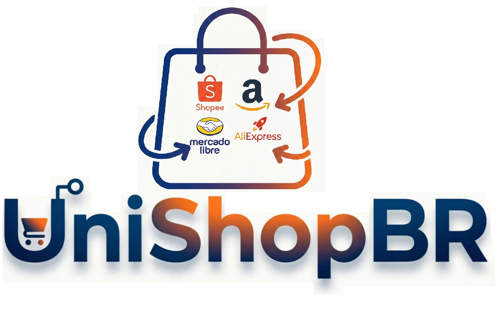

# 🛍️ UniShopBr - Catálogo Premium

<div align="center">



**Catálogo de produtos afiliados moderno e conversão-focused**

[](https://vercel.com)
[](https://react.dev)
[](https://typescriptlang.org)
[](https://tailwindcss.com)
[](https://supabase.com)

</div>

## ✨ Features

### 🛍️ Catálogo Público
- **Design Apple-inspired** - Minimalista e premium
- **Filtros avançados** - Por loja, categoria, busca e ordenação
- **Paginação otimizada** - Carregamento rápido e responsivo
- **Produtos em destaque** - Seção especial para ofertas
- **Analytics integrado** - Tracking de cliques em tempo real

### 📱 Página de Detalhes
- **Layout responsivo** - Imagem grande, informações organizadas
- **SEO otimizado** - Metatags dinâmicas para compartilhamento
- **Botão CTA destacado** - Máxima conversão
- **Informações completas** - Avaliações, preços, descrições

### 🔐 Painel Administrativo
- **Login seguro** - Autenticação Supabase
- **Dashboard completo** - Estatísticas e analytics
- **CRUD completo** - Gerenciamento de produtos
- **Upload de imagens** - Storage integrado
- **Interface intuitiva** - Design clean e funcional

### 📊 Analytics
- **Tracking automático** - Cliques registrados antes do redirect
- **Dashboard em tempo real** - Estatísticas de performance
- **Relatórios detalhados** - Produtos mais clicados
- **Exportação de dados** - Análises avançadas

## 🛠️ Tech Stack

### Frontend
- **React 18** - Component-based UI
- **TypeScript** - Type safety e melhor DX
- **Vite** - Build tool ultra-rápido
- **Tailwind CSS** - Utility-first styling
- **React Router** - Navegação client-side
- **Lucide React** - Ícones minimalistas
- **Sonner** - Toast notifications

### Backend
- **Supabase** - Backend-as-a-Service
  - PostgreSQL Database
  - Authentication System
  - File Storage
  - Real-time Subscriptions

### Deploy
- **Vercel** - Hosting otimizado para React
- **GitHub Actions** - CI/CD automatizado
- **PWA Ready** - Manifest e service worker

## 🚀 Quick Start

### Prerequisites
- Node.js 18+
- Conta Supabase
- Conta Vercel (opcional)

### 1. Clone o repositório
```bash
git clone https://github.com/seu-usuario/catalago-wellshop.git
cd catalago-wellshop
```

### 2. Instale dependências
```bash
npm install
```

### 3. Configure o Supabase
1. Crie um projeto no [Supabase Dashboard](https://supabase.com)
2. Execute o schema SQL em `database-schema.sql`
3. Configure as variáveis de ambiente:
```env
VITE_SUPABASE_URL=seu_supabase_url
VITE_SUPABASE_ANON_KEY=sua_supabase_anon_key
```

### 4. Configure o Storage
1. Crie bucket `products` no Supabase Storage
2. Configure políticas públicas para leitura
3. Configure políticas autenticadas para escrita

### 5. Execute localmente
```bash
npm run dev
```

Acesse `http://localhost:3000` para ver a aplicação.

## 📁 Estrutura do Projeto

```
src/
├── components/          # Componentes reutilizáveis
│   ├── ProductCard.tsx   # Card de produto
│   └── admin/           # Componentes admin
├── pages/               # Páginas da aplicação
│   ├── ProductDetail.tsx
│   ├── AdminPanel.tsx
│   └── AdminLogin.tsx
├── services/            # Serviços de API
│   ├── supabase.ts      # Config Supabase
│   ├── productService.ts
│   ├── analyticsService.ts
│   └── uploadService.ts
├── hooks/               # Hooks personalizados
│   └── useDebounce.ts
├── App.tsx              # Componente principal
└── main.tsx             # Entry point

public/                  # Assets estáticos
├── favicon.svg
├── favicon.png
├── favicon.ico
├── apple-touch-icon.png
└── manifest.json
```

## 🔧 Configuração

### Variáveis de Ambiente
```env
VITE_SUPABASE_URL=seu_supabase_url
VITE_SUPABASE_ANON_KEY=sua_supabase_anon_key
```

### Schema SQL
Execute o arquivo `database-schema.sql` no SQL Editor do Supabase para criar:
- Tabela `products` com validações
- Tabela `clicks` para analytics
- View `product_stats` para dashboard
- RLS policies para segurança

### Storage Configuration
1. Criar bucket `products`
2. Configurar políticas de acesso
3. Testar upload de imagens

## 🚀 Deploy

### Vercel (Recomendado)
1. Conecte seu repositório GitHub à Vercel
2. Configure as variáveis de ambiente
3. Deploy automático em cada push

### Manual
```bash
npm run build
# Deploy da pasta `dist`
```

## 📱 Rotas

| Rota | Descrição | Acesso |
|------|-----------|--------|
| `/` | Catálogo principal | Público |
| `/product/:id` | Detalhes do produto | Público |
| `/admin/login` | Login admin | Restrito |
| `/admin` | Painel administrativo | Restrito |

## 🎨 Design System

### Cores
- **Primary**: `#2563eb` (Royal Blue)
- **Background**: `#FAFAFA` (Light Gray)
- **Text**: `#374151` (Graphite)
- **White**: `#FFFFFF`

### Tipografia
- **Font**: Inter (Google Fonts)
- **Weights**: 300 (Light), 400 (Regular), 600 (Semi-bold), 700 (Bold)

### Componentes
- **Border Radius**: `rounded-2xl` (16px)
- **Shadows**: `shadow-sm` (subtle)
- **Spacing**: Generoso e consistente

## 🔄 CI/CD

O projeto usa GitHub Actions para deploy automático:

```yaml
# .github/workflows/deploy.yml
- Build automático em push
- Deploy para Vercel
- Testes e validações
```

## 📊 Analytics

O sistema rastreia:
- ✅ Cliques em produtos
- ✅ Visualizações de página
- ✅ Taxa de conversão
- ✅ Produtos populares

## 🔐 Segurança

- **Row Level Security (RLS)** no Supabase
- **Autenticação JWT** para admin
- **Validação de inputs** no frontend
- **CORS configurado** para API
- **HTTPS obrigatório** em produção

## 🤝 Contribuindo

1. Fork o repositório
2. Crie uma branch: `git checkout -b feature/nova-feature`
3. Commit suas mudanças: `git commit -m 'Add nova feature'`
4. Push: `git push origin feature/nova-feature`
5. Abra um Pull Request

## 📄 Licença

Este projeto está sob licença MIT. Veja o arquivo [LICENSE](LICENSE) para detalhes.

## 🙏 Agradecimentos

- [React](https://react.dev) - Framework UI
- [Supabase](https://supabase.com) - Backend BaaS
- [Tailwind CSS](https://tailwindcss.com) - Framework CSS
- [Vercel](https://vercel.com) - Hosting
- [Lucide](https://lucide.dev) - Icon library

---

<div align="center">

**Made with ❤️ by WellShop Team**

[🌐 Live Demo](https://catalago-wellshop.vercel.app) • [📧 Contact](mailto:contato@wellshop.com)

</div>
